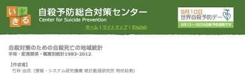

```{r knitr_init, echo=FALSE, results="asis", cache=FALSE}
library(knitr)
library(rmdformats)
library(DT)

## Global options
options(max.print = "75")
opts_chunk$set(echo = FALSE,
	             cache = FALSE,
               prompt = FALSE,
               tidy = FALSE,
               comment = NA,
               message = FALSE,
               warning = FALSE)
opts_knit$set(width = 75)
```

#　    

# A.委託研究

---

- 自殺対策のための自殺死亡の地域統計-手段・配偶関係・職業別統計1983-2012-の作成 (2015)
  国立精神・神経医療研究センター 精神保健研究所 自殺予防総合対策センターより委託
  
  
http://ikiru.ncnp.go.jp/genjo/toukei/index2.html


---


# B.著書

---

- 竹林由武  (2014). 「第9章 順序データのパス解析」，小杉考司•清水裕士 (編著)  
『MplusとRによる構造方程式モデリング』, 北大路書房

- 竹林由武  (2014).  「第15 章 潜在混合分布モデル」，小杉考司•清水裕士 (編著)   
『MplusとRによる構造方程式モデリング』, 北大路書房    
サポートサイト: https://sites.google.com/site/mplusandr/


![](data:image/jpeg;base64,/9j/4AAQSkZJRgABAQAAAQABAAD/2wBDABQODxIPDRQSEBIXFRQYHjIhHhwcHj0sLiQySUBMS0dARkVQWnNiUFVtVkVGZIhlbXd7gYKBTmCNl4x9lnN+gXz/2wBDARUXFx4aHjshITt8U0ZTfHx8fHx8fHx8fHx8fHx8fHx8fHx8fHx8fHx8fHx8fHx8fHx8fHx8fHx8fHx8fHx8fHz/wAARCAElANADASIAAhEBAxEB/8QAGgAAAgMBAQAAAAAAAAAAAAAAAQIAAwUEBv/EAEQQAAEDAgMDBwgGCQUBAQAAAAEAAhEDIQQSMUFRYQUGEyJxgcEUMkKRk6Gx4RUWUlRykiMkMzREU3PC0UNjgvDxNWL/xAAXAQEBAQEAAAAAAAAAAAAAAAAAAQID/8QAGREBAQEBAQEAAAAAAAAAAAAAAAERQSEx/9oADAMBAAIRAxEAPwDdx+ObgGUP1dtTpGyZMaRw4rhdzha3+BZH4vkjzjJFPBxaWnwWESXWjbqsjb+sTfuNP8/yU+sTfuLPz/JYmUZd14TZY0TUbX1ibMHAs/N8kv1ivbAU/wA/yWK4AX270MpIuU01tDnJv5PYP+fyR+sjdPIac/j+SwpAPW2JSwG+3tVHoPrG2JGBZH4vkh9YxP7jTj8fyXn7i02Nypssor0B5xgfwDPz/JQ85GgScCwf8/kvPZiLGbqQCbyqPQfWVn3Fn5/kj9ZGR+4s/P8AJefIAEyhlzWOiivQ/WSmTAwTOPW+Sb6xUyP3Nk/i+S86GBhsTPFQuc0QGzvKauPQHnI0a4Fn5vkgOcrTpgGfn+SwLnchEnRNMb55ygGPo9n5/kiOcrT/AADPzfJef0cARYBMHAnqzG4ppjePOVtv1Bn5/kgeczR/AU/z/JefJi9glJMSCquPQnnO0fwNP8/yUHOdm3A0x/z+S88DmNwUSxu1Ex6D6ztifIGfn+S6+TeWG8o1alLyVtLLTLswM+HFeSmNNFsc2CPLq8G/QO+IQsaHOITTwevmnwWIBPEFbfOIwzBk/YPgsUOzCYjtUrKOMiwAgzZB0cSd6gJRBdMIgaCRB7kDwmSoc0kiOxIXOdfuhEE21GuxAjKbQlh41Mjs0RgXAN0VDbSOJSGROWJ3qZZESoGkWsAECdYaJm5tqJN4Jk9iEdbWUVCXanTioGi+vrQJk6HvRDy3ZKNH2CNETYS4gIAnWxn3JXOaerCgUva4ad8IZwNCT3KxrWEaQqyA1xDVVGSSLKAGSbWSw46/FTKZvKAkgdyAId/hQ3brcJgQd08EC2BIk+pKHTvPBPt6wPalcINj6kEAGplbHNkDy+s7/Yd8QsYNJtM9q2ubE+W1hb9g74hVK7ucYOXBGCeqdO5Y3WMW14re5e8zCT9k+CymgTI9SlZc0OAsLqPa4GcrjOwLsEExooQ7YZQcRbUcb03AdiGR21h9S7m5uKlt6GOAsjSVDTOxpXeBuIKjmtBiCSoY4eicRZpCTow4EOB9S0coaOzipAkX7kXGb0JbIAKBpuboDO2y0XWOhKEDbKDNLXaGYQAP2Z7FpPaGiUkagtjboqrPLSdAZKjGOJJykdy7w3uRiBcoOICZBmd6jgZuDdd7Y1kW4qNiTtPYiuA0yBMOHcka1zrEETwWk9xJgD3JTMWCDgLcvokpIIBAaV3lp2n3KCwvMoOAgkCRrsSljtbrRInggBftRHB2zK2ubTQMdW39A74hcgZe8WWryHHlVWBH6F3gqL+XjDMJp5p17lkhxI1C1ecBIZg4+yfBZDfipWVggdqZhJJ6xASDYCLprExmII3IO1vJr3sa4VBpN9yor4d2HeA68ibDVa1M5MK10kgMB7bLm5Tpl1Frx6Lvcf8AoTBx4bDurPLQYtJK6HcnVNc7YVvJjS2k5x9IwF15g6nmBsRITDWG2TEaKSdYjvUYeo0z3ImDtEBZaAkkSYskykkkbV1YbDiu+A6BEkwur6PIcA19t5CqMy7BvKrNR+axWtU5MaRaq4O3wuChS/XG0iNHQe5MXT1cDWZRdUe9tmyRC5AOMFa3Kj4wwZpncBrff4KhvJzBQ6V9UtAbmNtLKprlZdsFo7UjwG3ab/BRrS4tDZl1l14nAsoUXVRVcYiBGsqK4ZLrEx2oHMDrZd+H5NdWph735Wm4EXKv+iqf8xyprJ7yoNZAXZi8D5OwOD8wmIIiFxkDbqgF5UkxbajF9IKZthcBAokXhaPIZ/Wq39F3gs8mNDC0OQzOKq3n9C7wSC/nB5mDt6J8FjjhZanOWoWNwUAXY7XuWF5U6/VaAqjr3SSUwLgN47FyDEkehZO3FnYPcoj0rIOFb+AfBV0gcTyeGyCSzLfegyofJGmI/Rj4Li5HxRc19MxIhwvM7/BVHcScNycdcwZHefmVbSgYZgH2B8FncrYotFKkBdxzEcB/77l3Uqh8lYY9AfBFcnJ9GnWpkPB6pAkdi6/IqGzN3FYFPF1BApuc0bQ1xCjsdW2VKtt9R3+VlWzyWwim959I2VGLxD34hwZUeymw5RlMSdq6MK7ocGzOYAbmcSdNqHk1F7i/KTmM2NrqovwubyZmZxcTeTquPk/9Nia1a0SY4Sbe5TlDHsoYc06Rb0hGWAfNG87k/JgDcI1w1eZ0VCYwCtjqdP7IjTfr7gFfyk8swjgDd5Df8+6Vn4bHMqcpOdVIEuOXduHuWnXYyu0B4kAzqgzcBTzYpv2WjNdX8qvB6Kkb3zH4eKvw4oszdCA4iziDKzqmKa7lkNqFvRt6t9NP8lRWww06tKKb+oRALDcKkYENcHNxGIkGb1JHqVdbC0a+WWBsfZAEqUKFLCEvDnRHpGyqOblMVm5GPq52Ekjqgaf+rl6JzKLalocYF9qmPxzMTiR0UFjBAO87Sr69Wvh8tHD4fpGDrdIWlwJ3jcorkJJNymN9q5a9eq2oTUZDyZILYhDp3HRt0V0uHBaHIX73V/ou+IWIcQ4HYtbm7VL8bWB/kO+ISC3nVduB/A7+1efB4j1L0POlpczAwD5rtO5YHRVT6JsqgBxE3CgednvR6F1zlKIpOIuCgvHJ9d8O6CQRMiLp/o/EEfsTHGFruqPw/JzajWZnNY2B6ly0OUcTVrMY7DiHEAwTbiiMao19B5a5pZvEQq7ZrNBWzy5TJNEhtyHD4LJFN8QWOneioXXm+mxPTeMzczDlm52kKro6v2bI5Kog5SB2IrVxfKbcRhn0qdJ7S60mFl9YDLJDdoTfpD6JbCMVXwA0qCMeGiAI4IFwebtnuU6N4vBB37ETSqWsUCk7LO26wjmEZTmA3TZEUHjRhUFF8AFpHYiqso22A2KwhuXXUbE/Q1InIT2hM2m4tuz1IKmkt0JAO4wlcC7z5cdkldPRO9FiPQvF8plTRzhhbcWKIq1RLWVHiNziFcaVSbtMIOounzDxTUUOJJJJLp2kyUbxJCdmHeS7qmxTilUGrDCoobEmWwFsc2wPLqxB/wBB3xCzeieT5vrC1eb1J7MbWLh/oOvHEJCuznB5mEj7J8FjbNPWtjnD5mD/AAnwWODxCVB1GnyUGUaKTBnwUm14QbhrChgm1HgkNY2w7lVR5RpVqraYp1Gl2hcBHxXDWxwqYXoBTjqgZp3LnoVeiqtfY5T61Ux1crU8tdjySc4MA7I/9VdYUaT2TRc5vRNJynadqXGYvyo0z0ZblnUzrH+EfLGEkGkXU3U2scCYMjcdyKpqOY900mOY2LhxldHR0PI6LqmZjnE3a2SUlOvSZiGPbRIa3UF0kq12PBDaYa6qwTnNWJPZCBMGwOe5vQNqt1LnOyho4psYxhAqYdrOhFszXZpPgqqOIyy18mmZIYIME6G+scU1bE0sj2Yem5pqEZy4AabgFBKNIVKTiWknMIsrq1ICk8tawWsY+appViKWUAxnbEA773TvrA035qZEyG8b9llzu6qiDugKOaNlk1yLhA8YncthYdvsoIGpJ7lCSNEM5QWzG33IZjbSOCrz7woCCoLQ6TZExIMTsSg22oGBcnVFFg865klMWkbUGDKIRJVQumq0ORo8pqx/Jd4LPi2i7+RP3mr/AEXeCQrq5aY17MLImGnwWV0LN0961+V/2eF3ZT4LMcOMDgFaio0g7YoKTNxlWAkfJSEFRosnb60DRbm071bodUHEHYSgrNFhuCh0LBMSe9WDsgIjLMIqoUmneEfJ6e2fWrLC4ChjN4IK+hbaJHYm6BoFgZ4KxpB0UudqA0aeQEtzecAWk2MpqjT0Z6ruqIu5w+IuozO8imx7AD6BiXW3Kt7WAkNqYW25on4rnfoYU2xt9aTo2knXvTAkW14pHU3ueHMPZOgsb+/3LYPQsOpPrQ6FkzBSihUEw+NSDrGv/dir8mc5hbU/SOB1LsvwVRcaLdxQ8naDoSmYwtaAOqBNvgucUsS2o50wC2AM2nhv+SK6BSG9QUmG0zt1VDqNY5SHGRrfZa0WG9PTpuFRjszgA2DAAGz/AAiLuhZtn1o9EzZKSqys6qzo4FMRmujh21WNd07gZ0A2KKJpN2SuzklgbiKpH8p3guYkLt5MjpqsfyneCsROXX5KeF080+CyPKHaGO1anL/7PCfhPgsaBM6pSLOmcBsCHlDr5gO4JQ3aRG5Rwte/YEUxruI9G/FQ13R1QFSQDoFLsHV1QW9NU3A9qPTOGwT2KiTJiOMITGhiyDpNd0XHqRFYncO1UydqYGLSFFW9IYm11OmdmjKEok+iEx7vWg6KNUUgazotZo3mEK9SqzDk1Q0OLgBYd6SnTaaNRwa1zwLEgmEa1MZKjhSA6pjqxHfKxvqKeng+aO1MMS4iwHcqDZoMSoA06G62ro6edRfsRNY6wAqJIGspS6dpPag6G13aQO1E1jsglc7WkAkGAERI1EygvNYnUICrGoVLQC6T3Ky21EMa7uEI9NtIlVEDZ8FIG4ygt6c7AI4rv5IeXYiqDH7J3gsqeK0eRDOJq/0XeCQqznC5rWYPMfRPgsbpaY9IdkrR51+bgY1yO/tWACBdzlakd3TsO2O1A1WbXe9cwJI6pgJDLTw3orrFWn9oGUDUZqT3LizGbTJ9ygGbj2FFdZq09QRGxTpWzqFztbFsoCUsIuJIKDsdVZEZh2lTpGxciy5WtiSblOKbSLkjsUF/SNiA4DtKtp1mgRnC4TTAbBN+KIaKcHU70Gl5Q0UnMzmDHm66ifcnquYcO0ZHANGYHK3Q/Bc+CrAMqjPUZlBf1Q2IHaNU2KxNapRpuplxY9rgZaJMHbbcs56E6Rkw9wQNSm3Rw7lx1CDq0BVS4GLAaXWhodKyfPHqUNVuxwXBJJvN9yJtIM96o7OlbE5giyo061BAXC4AaX4qDSYCDS6WmHCXAKGvT2QSsxxkg3ThrYkD3qYrvFdo9IdiQ1g704XE4QdgQiUHb0rR6QntWpyDUa7F1QCCehdp2hecy32ra5sfv9af5DviFUrq51eZgfwO/tWA2Ab2W7zsMMwOvmu/tXn2kO3q1mLpZBuJjekJI82FANxHZCDhOguopDAtMnco1pmZAUNtBBUbB1dfsRUIcDd09qYOtd1tl0nm7LJ2w4iddyBgDrNuG1Esc3Rxg6okZDMmOxT3KBCb3MlPI0i6LmgiwjvSx1TsQdGGdUB6NuI6KTYZJn3KVar6bKrGYoOc43BaZ3GCphsQ6m9jTUDaea9gmxT3lj/1qi9hNmNIJInsWejjBDrGQl2mRITAA2JA4IuIiIlbUkkeagXHcE2t0CSJsUQLHejFtfepZDNFzEIpYjWU0A7SoIOiYNMIBlduU0RgoXHBABxkLY5sf/Qrf0HfELIgFu4rY5sEnHVgZnoHfEKpXTzrMNwP4Xf2rzwv2L0XOoAswM/Zd/avPBpjRGUnLstshA7TMDcrMjtToldSjTRRVRjYnFM7VYynfzSrCMsDLHFNFQYYiB3lQNjU34qzohcHvRgt0Ou9TQGtMQXSg8kGIhWBps2Tx2pK5iARf1JFVuLp1CLYcN6VtzBMhG0kyg6sOGsaSTQ3RV2I4kmmHCcMxwF2s1uPmqMPlp53Gi6qBeJgDtSVDUqOdXdBzOgnju9SnRW4DbZNlBEESEbBsESTsTtptIGv+FpVWWBb/CM24pi1rSbGUHHegQkqACLIxKIsAgEIhwAgzKhg3AvtCEdsILIBbIS22ypOg0QJhQI4ibStjmx+/wBbX9g74hZYDSZvK2ebkeW1iNegd8QqldHOcS3Bfgd4LBgxcWW/zm8zBH/8u8FiSALOCVgrA2IkxxUIy6AzpO5ABxuAeCl2m4soqMzSOt7kxaW8Z3m6dkgnKbJi2LkX4hSqqFpEZoG9OBJBAntRAFg7rTs3I6HZG87FFVvcWagDsuqqtTpGti3BPVEbyCIVDIY7fOxaiCwEcFDNgRJVltwRdBboUDYaoBTrtMy5hAAEo1KZp4JjXCHOq5gDrGWE2Gpkk9HWFJ4s3Nt70BSdUD6heXZRdznbFBzZQTfXtuFZkaLyexK6AhO0WWlMTsAtxRgRcJAT9pTPsFyoFIylH4KTm1EqGyoII9IWTzTMb+CQSG66oNAM37FFFzhOko5erJ7uCWdkKxrSRtHagQGDaZWzzccDjawi/QO+IWLl60LZ5uNy4+sJn9A74hXqV185RLMF+E+CwDn0NxsC9Bzk8zB/hPgsOxiClYUjpAbGOwpi2pti29PF9YS2FgfWirKYsCcpG20J80ec0ZSudri0yN+id9Z2jrcAFnBdmdJADRxBuleSxt3A8IXKZJMO7UG2mRIO0pirHukAyBGyUg4XUjcfXdXCnAvqqisBTNBumcIMpgyRaURKIpPDnVKopgbCJnsVlWs0sFKi0tpzJJ1cUKPRUialQ5i02YBclXPcw4Z1RjOic90NvM7/AHSs9VxOGaIIVJY4G66LgQY9aQ3WlVA7AQCiTGhui7hrtVbiZtcbVQcxRbJJMApQP+wrWtNjBHYimNMki8Iup9SIEhO07dQiRGwLKlYBEttvTWOiUQHGdCFUx3WJhEEdVx0stbm2Zx9b+g74hZJuVq82p8urX/0HfELUK7ecnmYP8J8Fhh5aSLkLc5yxkwUmOq7wWClYK5xceCUuvtPcmIuN/YgRHaioW2kghKXAec4nvRJJtt3ypaTmKIAcSSW/+qWm+Y8UzYO2wRJbljKXEcAooZCSCmNR7miCBCQuLYOk8FY2mSM2a52oAA5wJJlW5gGnYBwXNJaYuDxVgqGUHVQhxcRTZUO9xgD/ACq8Q6qaxFUhpaIAGg7EaLOldndAptu5xFlMQDXb5RSaS0+e3WCs9FRJtcKkth0yU0Hj8EXAhsrQQtDhB1Rps2RPBSdbTCtYST1UCCmYym0bFccoADbwiZaYO5ENBIHio1AuNkFCCd5KtgA37kCDBAtx2qK53NBERB4JQ0E7ir8g1vZVvIBMKip1jf1rV5tfv9aP5DviFkunetbmyf16t/Qd8QtRK7ecvmYPfld4LB2aLe5zGGYL8J8FgEnXUpWBEb47kLb5RDSZgEj5IZtyil3kEKEwZIJKYkxeAEAxx012IELb5riUC+14CsdSdEzKrLSPR9V0ClxMDVvZomaSNCDu2qdsA7EBIdMg8VQXS47SeCOXYUQeqJS3Hm/BB34XDtrUBmz5TUjKCYFtUThm06DnN6QTTkwTB4aR71z5gMEGlwzdLMA3iFdRc3yes/pGdZhaGTeexYyjm6xubdpULXOMl0t7Lq0CAU/VOwDtWgjWNAsNeCdjYRaIOg9aj4eMpt2KBXOAg2E8UBMybkLmq0y2QQSd6DKj2NGXTdCuLHXmBMm6bMItEbVzis0tMnKeASPcWwW1MymNOsnaEhE6+uVRTqkEkhXh4eLXTBS+jLpBk7lpc2mkcoVpF+gd8QuB5J1sO1anN4Dyysf9h3xCsSr+cxhmC/A7wWD5wvZb/OUfo8H+A+C884QZ1VrMW0xDT4iZVRM3AXRQAdTgtkzt3Lmdc/JAddhUD8rp8UJnaJ7UpN9kIqw1Y1FlBUYQJ96pnbbtRI7ExBIk2MqQc0TAQl3qUvfrAjagYkDSRO9E3Ii0CEGk6Ag7rKyb5SQNyiBoLMntU6wEtBCMGdZQbIEGABtCKIcZnQ6XTZ9u/aUuabHQ70YmLW3IixtQiNTxRzBxBKpBAOkJpvbXcUVcXCDPqCVs5eCqJGUxqi0i2zgmBazGROniuckg9UGDrK6Kr7gNiEGAAzE7ro0rax1oHvVzWZBJJngiNfN7gi4iNYQUh5bIIk8Vr83HTja069A63eFkVADeSStXmyZx1b+g74hWFdvOUxTwcfYd4LBc4OEnVbnOf9ngvwnwXn3C90qR1YYHo3dYNExf/wBXIbO1PYiLea4x2oQdZhBNmglDXYUCag2AoZ3xuQA2RsDM8UC46FSTuVBLmiBqUM4I80hSDwCkuJuURM7TMtVjXAgWMBBsu2jthOQ5oEQVBA8DYQpmBsCoS/aFL7roiAzs9ykEIC+yYTiVAIBF3EIHUjVMBdEwBCBIM2UAjYe5GINh60C4AbNUVHOHpIZouCkmXaASo6Dstu3qqt6TNEXSnZN0o0sLKTpsUUzuErW5tfv1Y/7DviFkbJWvzany6tu6B3xCsK28VSw+MbTGIol/RiBDyP8Aui5jyVycdcO72pUUVZD6J5N+7O9qVPojk37s/wBqVFEAPJHJp1wz/alT6H5NP8M/2pUUQA8jcmEQcM/2pRHJHJo/hne1KiiA/RPJ33Z3tSh9D8mzPkzvalRRAfonk4fwzvalQclcnDTDv9qVFEQfork77u/2pR+i+T/uzvaFRRBPovk77s72hQ+i+Tz/AA7valRRBPovk/7s72pU+i+T/u7valRRBDyVycdcO/2pQ+iOTfuzvalRRFT6J5O+7O9qUTyVycf4d3tSoogn0Vyd92d7Uo/RfJ/3d3tSoogH0Vyd92d7Uq7C4TCYNzn4eiWuc0tkvJsVFEH/2Q==)


---

# C.学術論文 (筆頭著者・査読あり)

---

- Takebayashi, T., Kubota, T., & Tsubaki, H. (2016) Risk profiles for severe mental health problem: Classification and regression tree analysis. Proceedings in Computational Statistics 2016 (COMPSTAT2016).

- Takebayashi, Y. Tanaka, K., & Sugiura, Y. (accept with revision). Psychological Well-being and Generalized Anxiety in Japanese Undergraduates: A Prospective Cohort Study, Journal of Happiness Studies.  

- 竹林由武・高垣耕企・広瀬慎一・大野哲也・小幡昌志・川崎友也・シールズ久美・杉浦義典・坂野雄二 (2013) Anxiety control questionnaire日本語版の開発，行動療法研究，39,  145-154.   

- 竹林由武・ 高垣耕企・ 杉浦義典 (2012) Generalized anxiety disorder questionnaire for DSM-IV日本語版の開発, 精神科診断学, 5, 89-98.

- 竹林由武・ 笹川智子・ 坂野雄二・ 杉浦義典 (2012) The short intolerance of uncertainty scale日本語版の開発, 認知療法研究　第5巻, 179-187．

- 竹林由武・富家直明・坂野雄二 (2009) 自殺念慮の強い抑うつ患者の精神科受療開始に成功した訪問相談の経験, 北海道医療大学心理科学部心理臨床・発達支援センター研究　第5巻1号，61-67.  


---

# D.学術論文 (筆頭著者・査読なし)

---

- 竹林由武・杉浦義典 (2015) 「PART II 第一章全般性不安症」，『こころの科学別冊「不安症の辞典」』，日本評論社, pp46-49.　
- 竹林由武 (2014) 「観察研究の必須事項」，『行動療法研究』, 40, 167-175.
- 竹林由武・杉浦義典 (2014) 「量的データの集め方・扱い方」，『臨床心理学』，増刊第6号．
- 竹林由武 (2013)「この人をたずねて(富山大学人間発達科学部教授村上宣寛)」，『心理学ワールド』，64号，pp34-35．

---

# E.共同研究論文 (共著)

---
- Jinnin, R., Okamoto, Y., Takagaki, K., Nishiyama, Y., Yamamura, T., Okamoto, Y., Miyake, Y., Takebayashi, Y., Tanaka, K., Sugiura, Y., Shimoda, H., Kawakami, N., Furukawa, Ｔ. A., & Yamawaki. (in press). Detailed course of depressive symptoms and risk for developing depression in late adolescents with subthreshold depression: cohort study. Neuropsychiatric Disease and Treatment. Neuropsychiatric Disease and Treatment.

- Fujisato, H., Ito, M., Takebayashi, Y., Hosogoshi, H., Kato, N., Nakajima, S., Miyamae, M., Oe, Y., Usami, S., Kanie, A., Horikoshi, M., & Berking, M. (in press). Reliability and Validity of the Japanese Version of the Emotion Regulation Skills Questionnaire Journal: Journal of Affective Disorders.

- Saigo, T., Takebayashi, Y., Tayama, J., Bernick, P. J., Schmidt, N. B., Shirabe, S., & Sakano, Y. (2016). Validation of the Japanese Version of the Body Vigilance Scale. Psychological Reports.

- Shinmei, I., Kobayashi, K., Oe, O., Takagishi, Y., Kanie, A., Ito, M., Takebayashi, Y., Murata, M., Horikoshi, M., & Dobkin, R. D. (2016). Cognitive Behavioral Therapy for Depression in Japanese Parkinson's Disease Patients: A Pilot Study. Neuropsychiatric Disease and Treatment.

- Ito, M., Horikoshi, M., Kato, N., Oe, Y., Fujisato, H., Nakajima, S., Kanie, A., Miyamae, M., Takebayashi, Y.,  Horita, R., Usuki, M., Nakagawa, A., & Ono, Y. (2016). Transdiagnostic and transcultural: pilot study of unified protocol for depressive and anxiety disorders in Japan. Behavior Therapy.

- 高田圭二・田中圭介・竹林由武・杉浦義典(2016). マインドフルネスとwell-beingと注意の制御の関連 パーソナリティ研究

- Tsukue, R., Okamoto, Y., Yoshino, A., Kunisato, Y., Takagaki, K., Takebayashi, Y., Tanaka, K., Konuma, K., Tsukue, I., & Yamawaki, S. (2015). Do individuals with alcohol dependence show higher unfairness sensitivity? The relationship between impulsivity and unfairness sensitivity in alcohol dependent adults. Alcoholism: Clinical and Experimental Research.

- Takagaki, K., Okamoto, Y., Jinnin, R., Mori, A., Nishiyama, Y., Yamamura, T., Takebayashi, Y., Ogata, A., Okamoto, Y., Miyake, Y., Shimoda, H., Kawakami, N., & Yamawaki, S. (2014). Behavioral characteristics of subthreshold depression. Journal of Affective Disorders, 168, 472-475.

- 田中圭介・杉浦義典・竹林由武　(2013)　注意の定位機能とマインドフルネス傾向の関連―注意の喚起機能による調整効果―，パーソナリティ研究．22, 146-155.