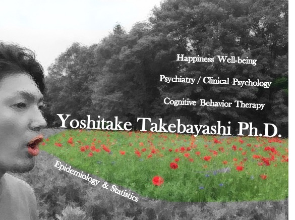

```{r knitr_init, echo=FALSE, results="asis", cache=FALSE}
library(knitr)
library(rmdformats)
library(DT)

## Global options
options(max.print = "75")
opts_chunk$set(echo = FALSE,
	             cache = FALSE,
               prompt = FALSE,
               tidy = FALSE,
               comment = NA,
               message = FALSE,
               warning = FALSE)
opts_knit$set(width = 75)
```



  
  
# A.現所属
> 大学共同利用法人情報・システム研究機構  
  統計数理研究所 リスク解析戦略研究センター  
  特任助教

> 国立精神・神経医療研究センター  
認知行動療法センター  
研究生　

---

# B.研究テーマ
> - 自殺念慮の重篤化を予測するモデルの構築
- 残遺症状のある感情障害患者の生活機能の改善
- Well-beingの向上による感情障害の予防
- ウェアラブル機器を活用したQOLの評価手法
- 認知行動療法の有効性評価と作用プロセス

---

# C.学位
- 2014年　広島大学大学院総合科学研究科総合科学専攻博士後期課程 修了 博士 (学術)  
博士号学位論文『心理的ウェルビーングの向上が全般性不安症状の増悪を防止するプロセスの検討』 (指導教官　杉浦義典)
- 2010年　北海道医療大学大学院心理科学研究科臨床心理学専攻修士課程修了 修士 (臨床心理学) (指導教官　坂野雄二)  
修士論文 『不確実さを解消する接近的な方略が不確実さ不耐性と過剰な心配に及ぼす影響の検討』
- 2008年　立命館大学文学部心理学科卒業 学士 (心理学) (指導教官　尾田政臣•東山篤規)  
卒業論文 『思考抑制が注意バイアスに与える影響−自動的処理過程と意識的処理過程における検討』

---

# D.職歴
- 2009年04月〜2010年03月　留萌市立病院　非常勤心理士
- 2009年04月〜2010年03月　岩内協会病院　非常勤心理士
- 2011年12月〜2013年03月　広島大学大学院医歯薬保健学研究科研究員
- 2013年04月〜2013年03月　日本学術振興会　特別研究員 (DC2)
- 2014年04月〜2014年08月　日本学術振興会　特別研究員 (PD)

---

# E.教育歴
- 2008年5月〜2010年2月　北海道医療大学心理科学部 Teaching Assistant
- 2010年4月〜2010年8月　北海道ハイテクノロジー専門学校　非常勤講師 (心理学)
- 2011年4月〜2014年3月　広島大学大学院総合科学研究科 Teaching Assistant
- 2014年04月〜2014年8月  比治山大学短期大学部　非常勤講師 (文章デザイン演習•情報処理リテラシー)
- 2015年04月〜2016年3月  専修大学人間科学部　非常勤講師 (データ解析.: 心理統計学)
- 2015年04月〜2016年3月  専修大学人間科学部　非常勤講師 (心理学講読.: 心理学外書講読)
- 2015年04月〜2016年3月  専修大学大学院文学研究科　非常勤講師 (基礎心理学特講: 心理統計学)
- 2015年04月〜2016年3月  東京医科歯科大学　非常勤講師 (看護情報統計学)
- 2016年04月〜2017年3月  専修大学人間科学部　非常勤講師 (心理学講読: 心理学外書講読)
- 2016年04月〜2017年3月  東海大学理学部数学科　非常勤講師 (確率統計)

---

# F.受賞歴　
- 2010年　行動療法学会 WCBCT2010記念若手研究奨励基金
- 2012年　認知療法学会 若手奨励基金
- 2012年　広島大学校友会　第6回ドリームチャレンジ賞  
活動テーマ：「心理学研究の立案・成果報告に役立つ実践的データ解析法の普及」